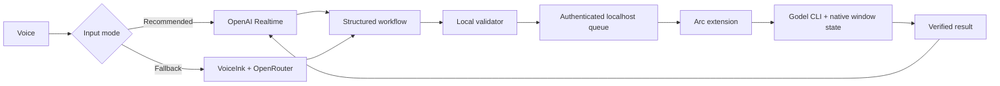

# Godel Voice

A local, voice-first “Jarvis” for [Godel Terminal](https://godelterminal.com). Speak naturally; Godel Voice translates the request into validated Godel commands, opens the requested panels, operates verified controls, arranges the workspace, and answers only after Godel confirms the result.

> [!IMPORTANT]
> This is an independent, unofficial project. It requires your own Godel account and API credentials. It does not include, proxy, or redistribute Godel data.

## What it feels like

Start Jarvis and say:

> “Pull up the market heatmap on the left and Amazon earnings on the right.”

Godel Voice opens `HMAP` and `AMZN EM` as separate commands, places the two native Godel windows, and replies after both actions are verified. Follow with:

> “Make the earnings window bigger.”

Other useful examples:

- “Compare Amazon, Meta and Microsoft over five years as percentage change.”
- “Show Nvidia's option chain with fifteen strikes.”
- “Search Amazon earnings calls for AWS backlog and tell me which quarter mentioned it.”
- “Close the heatmap and put active market halts on the left.”

You do not need to click Godel's **Type a command…** field. Keep the authenticated Godel tab visible and active; the extension addresses that tab directly.

## Why this is not ordinary dictation

Godel Voice separates understanding from execution:

1. OpenAI Realtime or VoiceInk transcribes the request.
2. A structured planner maps natural speech, company names, corrections, follow-ups, layouts, and nested features to Godel intent.
3. Local deterministic validation rejects invented commands, unsupported controls, ambiguous securities, and unsafe mutations.
4. A scoped Arc extension submits each command separately and uses Godel's native UI/state actions for verified nested controls and layouts.
5. Jarvis speaks only from the verified completion result.



## Requirements

- macOS with [Arc](https://arc.net) or a compatible Chromium browser. Arc is the tested target.
- An authenticated Godel Terminal account.
- Node.js 22 or newer.
- For recommended Realtime mode: an OpenAI API key with Realtime access.
- For the VoiceInk fallback: VoiceInk plus an OpenAI-compatible intent provider such as OpenRouter, Groq, or Cerebras.
- Optional: ElevenLabs for the non-Realtime completion voice.

## Quick start — Realtime Jarvis

### 1. Clone and configure

```sh
git clone <repository-url>
cd godel-voice
cp .env.example .env
```

Edit `.env` and set:

```sh
GODEL_VOICE_REALTIME_ENABLED=true
OPENAI_API_KEY=your_openai_api_key
GODEL_VOICE_REALTIME_MODEL=gpt-realtime-2.1
GODEL_VOICE_REALTIME_REASONING_EFFORT=low
GODEL_VOICE_REALTIME_VOICE=cedar
```

Never place a key in `extension/`, source code, documentation, or a Git commit. `.env` is ignored.

### 2. Install the local service

```sh
npm install
npm run setup
npm run doctor
```

Setup creates a private localhost secret, writes the ignored extension configuration, and installs a per-user macOS service that restarts automatically.

### 3. Load the Arc extension

1. Open `arc://extensions`.
2. Turn on **Developer mode**.
3. Choose **Load unpacked**.
4. Select this repository's `extension/` folder.
5. Open or reload `https://app.godelterminal.com`.

The lower-right corner should display **Jarvis ready**.

### 4. Speak

Click the Jarvis control or press **Control–Shift–J**, allow microphone access, and try:

> “Open the heatmap on the left and Amazon earnings on the right.”

Click the control again, press **Escape**, hide Arc, or switch away from Godel to stop the microphone.

## Updating an existing installation

```sh
git pull
npm install
npm test
npm run service:restart
```

Then reload **Godel Voice Executor** in `arc://extensions` and reload the Godel tab. An already-open tab retains the previous unpacked-extension context until both reloads occur.

## Choose an input mode

| Mode | Best for | Services | Notes |
|---|---|---|---|
| OpenAI Realtime | Continuous Jarvis conversation | OpenAI | Recommended; one interruptible voice session, persistent conversational context, native spoken response |
| VoiceInk | Lower-cost push-to-talk fallback | VoiceInk + OpenRouter/Groq/Cerebras | Uses the same local compiler, validators, queue, and extension |
| Text compiler | Development and debugging | Any OpenAI-compatible provider | Run `npm run compile -- "your request"` |

Realtime and VoiceInk are independent entry points into the same guarded executor. They cannot bypass the local allowlist.

## Safety and privacy

- The server binds only to `127.0.0.1` and requires a randomly generated local bearer secret.
- Provider keys remain in a mode-600 local environment file and never enter the extension.
- Raw audio is not stored. Realtime transcript/tool auditing is off by default and private when enabled.
- Every command, security, nested action, and layout is validated again locally after model output.
- The extension addresses the active Godel tab; it does not use global keystrokes, the clipboard, AppleScript, or screen coordinates.
- Ambiguous companies and unsupported controls fail closed instead of silently guessing.
- Consequential account, brokerage, communication, billing, alert, and trading mutations are gated or unavailable unattended.

## Repository map

| Path | Purpose |
|---|---|
| `extension/` | Arc/Chromium executor, native Godel adapters, window layout, Realtime client |
| `src/` | Compiler, routing, local server, validators, layout planner, grounded responses |
| `data/` | Command registry, compact context, schemas, capability contracts, evaluation cases |
| `tests/` | Offline safety, parser, adapter, layout, handoff, Realtime, and regression tests |
| `docs/user-guide.md` | Supported phrases, command families, boundaries, and recovery guide |
| `docs/panel-adapters.md` | How to add a verified nested Godel control |
| `docs/model-evaluation.md` | Accuracy, latency, routing, and benchmark methodology |
| `reports/` | Retained model and capability audit evidence |
| `bin/` | Setup, service management, diagnostics, and VoiceInk delivery |

## Project status

This is working experimental software, not a promise that every visible Godel control is automated. Godel can change its undocumented frontend internals. The executor therefore promotes a nested action only after it has a unique target, a native or exact interaction path, and a verifiable completion state.

## Coverage

- 59 canonical commands: 47 from Godel's official public command index and 12 additional commands observed in the live terminal.
- 424 catalogued nested feature bullets across those commands.
- 69 accepted command tokens after documented aliases are included.
- Every canonical command has a command-specific parser/schema module. The architecture audit has **zero generic-catalog-only gaps**.
- Nested features are represented explicitly, including News filters, halt tabs, option-chain settings and Greeks, chart controls, screener fields, market-map controls, ownership views, calculators, workspace mutations and exports.
- Live-only commands are marked `live-undocumented`; the compiler is forbidden from inventing arguments for them.

Coverage is intentionally split into three states. **Live** means at least one exact nested action has a verified runtime binding. **Strict-unbound** means the command-specific intent, values, contradictions, safety rules and completion proof are modeled, but execution remains disabled until the UI binding is proved. **Safety-gated** means read-only access may be available while consequential or persistent mutations require confirmation or remain unsupported unattended. Current totals are 11 live commands, 39 strict-unbound commands and 9 safety-gated commands. These labels describe nested controls; every validated canonical command can still be opened through Godel's CLI.

Run `npm run build` to regenerate the compact catalogue, source manifest and size report. The current compact catalogue is approximately 3.6K tokens, the single-command system prompt approximately 6.6K, and the full multi-window workflow prompt approximately 8.2K. The relevant prompt is sent once per voice request rather than queried through a slower retrieval round trip.

## Files

- `data/commands.json`: human-readable source of truth with intents, aliases, constraints and nested features.
- `data/catalog.min.txt`: generated always-loaded context for the model.
- `data/intent.schema.json`: strict provider-facing JSON Schema.
- `data/workflow.schema.json`: strict multi-window voice-workflow schema.
- `data/voiceink-system-prompt.txt`: generated prompt ready for a VoiceInk AI Enhancement profile.
- `data/eval-cases.json`: initial natural-language evaluation set and confusion cases.
- `data/noisy-eval-cases.json`: complete command coverage using fillers, misspellings, phonetic ASR errors and self-corrections.
- `data/sources.md`: coverage audit linking documented commands to Godel's official pages.
- `src/compiler.mjs`: OpenAI-compatible provider client, validator and terminal renderer.
- `src/consume-intent.mjs`: validates JSON already produced by VoiceInk's enhancement model.
- `src/automation-plan.mjs`: converts validated intents into backward-compatible `GV1:` plans or ordered `GV2:` workflows.
- `src/workflow-plan.mjs`: deterministic workflow validation, failure policies and layout hints.
- `src/layout-engine.mjs`: provider-independent layout planner and presets.
- `extension/`: unpacked Manifest V3 Arc/Chromium extension for tab-addressed command delivery, exact nested adapters, native workspace controls, completion feedback and verified download receipts.
- `docs/panel-adapters.md`: reusable adapter contract for extending nested voice control to additional Godel panels.
- `docs/user-guide.md`: non-technical guide to natural phrases, current support boundaries, layouts, follow-ups, exports, safety and recovery.
- `bin/voiceink-deliver`: VoiceInk Custom Command that validates and queues a plan on localhost without controlling the keyboard.
- `src/handoff-server.mjs`: authenticated loopback-only handoff between VoiceInk and the Godel tab.
- `src/prompt.mjs`: grounded command-compiler instructions.
- `tests/registry.test.mjs`: coverage, compactness, alias and rendering tests.

## Intent representation

The compiler distinguishes terminal syntax from UI work. For example:

```json
{
  "kind": "execute",
  "confidence": 0.98,
  "command": "HALT",
  "security": null,
  "arguments": [],
  "post_open_actions": [
    {"feature": "tab", "operation": "select", "value": "Active"}
  ],
  "clarification": null,
  "reason": "User requested currently active U.S. market halts."
}
```

The terminal renderer outputs `HALT`. A later UI executor selects the documented **Active** tab. It does not falsely generate `HALT ACTIVE`, because `Active` is a UI feature rather than a documented CLI argument.

## Provider configuration

The client uses the OpenAI-compatible `/chat/completions` contract. Configure any compatible provider:

```sh
export VOICE_LLM_BASE_URL="https://api.groq.com/openai/v1"
export VOICE_LLM_API_KEY="..."
export VOICE_LLM_MODEL="..."
npm run compile -- "open Amazon's earnings matrix"
```

Other base URLs:

- Cerebras: `https://api.cerebras.ai/v1`
- OpenRouter: `https://openrouter.ai/api/v1`

For OpenRouter, optional attribution headers can be set with `OPENROUTER_SITE_URL` and `OPENROUTER_APP_NAME`.

### OpenRouter provider pinning

Copy `.env.example` to `.env` and supply an OpenRouter API key. Routine commands first use the local deterministic compiler, so opening, closing, arranging, VIX and common contextual controls do not pay model latency. Remaining language requests use GPT-OSS-120B pinned to Cerebras; only a timeout, transport failure, or locally rejected plan falls back to `google/gemini-3.6-flash` pinned to Google Vertex. Provider fallback inside OpenRouter stays disabled, so the recorded provider is authoritative.

On the 164-case spoken benchmark, Gemini 3.6 Flash reached 73.2% exact semantic success at 1,771 ms p50 / 2,995 ms p95. In realistic single-request runs, Cerebras reached 62.8% at 524 ms p50 / 1,169 ms p95 and Groq reached 61.0% at 815 ms p50 / 1,540 ms p95. Gemini was materially stronger on noisy speech and multi-step workflows, but real full-compiler checks took 3.9–4.5 seconds and one exceeded five seconds. The production budget therefore gives Cerebras one 1,300 ms attempt, then Gemini at most 3,500 ms only after failure, under a 4,800 ms ceiling. A deliberate `clarify` or `unsupported` result never pays fallback latency. GLM-4.7 and Gemini 3.1 Flash Lite were rejected because they were slower and/or less accurate in this harness.

The local `.env` file is intentionally ignored by Git. Never commit API keys.

Strict JSON Schema is the default. If a chosen model/provider only supports JSON-object mode:

```sh
export VOICE_LLM_RESPONSE_FORMAT="json_object"
```

The full schema remains in the cached system prompt in either mode.

## VoiceInk handoff

VoiceInk does not need to host the intent model. Its Godel Mode can use any transcription model and deliver the final transcript to this local compiler through stdin. The compiler intentionally accepts either command-line text or stdin.

Set the Godel Mode output to **Custom Command** and use:

```sh
"$(pwd)/bin/voiceink-deliver"
```

VoiceInk needs the resolved absolute path, so run `pwd` in the cloned repository and append `/bin/voiceink-deliver`. No username or fixed installation directory is embedded in the software.

Leave VoiceInk AI Enhancement off for this mode: the local command already sends the plain transcript to the configured Godel intent model. VoiceInk's stdout is not pasted into the active app when Custom Command output is selected.

VoiceInk can send either its plain transcription or an enhancement model's final JSON through stdin. Plain speech is compiled through the configured OpenRouter model into a `GV2:` workflow, even for one command. Precompiled legacy JSON remains compatible through `GV1:`. Plans are queued through an authenticated server bound only to `127.0.0.1`. On macOS, setup installs a per-user LaunchAgent so the handoff is ready after sign-in and restarts if it crashes. Elsewhere, delivery starts a checkout-verified background process; the same start command can be added to the user's normal session startup.

The visible Godel tab polls for a plan. Its Arc extension verifies the sender URL and uses Chromium's tab-addressed debugging API to deliver input to that tab alone. It does not use AppleScript, macOS Accessibility, global keystrokes, the clipboard, or Computer Use, so input cannot spill into another application.

Only the visible, focused, active Godel tab may lease a workflow. The lease belongs to that tab's opaque session ID, is renewed while long workflows run, and can be completed or retried only by the same tab. If Arc disappears, work returns to the queue; after four abandoned attempts it fails closed instead of executing forever.

### One-time local setup

```sh
cd /path/to/godel-voice-spec
npm install
npm run setup
npm run doctor
```

`npm run setup` writes ignored local configuration and installs automatic startup. On macOS it copies a small server runtime bundle plus mode-600 secret/environment files into `~/Library/Application Support/GodelVoice`; this avoids macOS background-access restrictions on Documents while the repository remains the source of truth. API keys are never written into the service definition. Run `npm run service:restart` after changing `.env` so the private runtime copy is refreshed. Service controls are:

```sh
npm run service:status
npm run service:restart
npm run service:stop
bin/godel-voice-service uninstall
```

Delivery verifies the protocol and a fingerprint of this checkout before submitting work. It replaces an obsolete process only when that process is running this checkout's exact server path; it refuses to kill an unrelated process or another clone on port 17841.

### Diagnostics and privacy

`npm run doctor` checks Node, private secret permissions, extension/server secret agreement, model and optional ElevenLabs configuration, service registration, protocol/checkout/build identity, port ownership, and persistent queue readability. Runtime diagnostics under `logs/` (or `~/Library/Application Support/GodelVoice/logs` for the macOS service) rotate at roughly 5 MB. They contain workflow IDs, lifecycle events, command/control names, hashed step references, durations and redacted errors—never the voice transcript, compiled marker, API key, bearer secret, or terminal command. Credentials and plan bodies are passed to the local HTTP client through private files and stdin rather than process arguments.

```sh
npm run doctor
npm run service:status
tail -n 50 "$HOME/Library/Application Support/GodelVoice/logs/godel-voice-events.jsonl"
tail -n 50 "$HOME/Library/Application Support/GodelVoice/logs/server.stderr.log"
```

Each workflow records total execution time plus per-step command/control duration, making a slow model, browser command, nested adapter, or layout operation distinguishable without recording what the user said.

Then open Arc's extensions page and reload **Godel Voice Executor** once. Version 0.11.0 uses Chromium's `debugger` permission for tab-addressed command-bar input and the `scripting` permission to run allow-listed Godel adapters in the page context. Arc may display a brief debugging notice while a command is entered; the extension detaches after every input batch.

Load `extension/` as an unpacked extension in Arc. Its host access is limited to Godel plus the loopback handoff at `127.0.0.1:17841`.

Every validated Godel CLI command can be opened. Nested execution is narrower and uses a command-addressed, fail-closed adapter registry. The following block is the exact current enabled set and is checked against `data/adapter-contracts-v1.json` by the test suite.

<!-- enabled-controls:start -->
- EQS.range_filter.add
- EQS.list_filter.usd_technology
- EQS.screen.run
- EQS.screen.clear
- HDS.view.select
- MOST.results.select
- HMAP.universe.select
- HMAP.view.select
- EM.metric.select
- EM.valuation.read
- IMAP.map.configure
- N.query.set
- SECF.people_search.configure
- OMON.strike_depth.set
- G.chart.resolution.1h
- HMS.comparison.configure
<!-- enabled-controls:end -->

In practical terms: HMS can configure securities, timeframe, percentage/dollar mode and normalized/overlay/side-by-side layout; G can set the verified 1-hour interval; OMON can set native strike depth; News can set an exact per-window query; EM can select a documented matrix metric and read exact valuation rows with row-correct multiple or percent units; HDS can choose Table/Treemap/Bubble; HMAP can choose S&P 500/DJIA and Map/Table; IMAP can choose S&P 500 or DJIA plus Map/Table; MOST can choose 10/25/50/100 results; SECF can run an exact People search with a 50/100/250/500 cap; and EQS can set its 14 verified numeric ranges, the exact USD and Technology list values, Run and Clear.

Three older adapters remain live outside that newer contract-registry snapshot:

- GF has authenticated live proof for adding companies; Revenue, Gross Margin, Operating Margin, Net Margin, R&D as % of Revenue, SG&A as % of Revenue, Return on Equity and company-dependent P/E/P/S/P/B/P/CF metrics; 1Y/3Y/5Y/10Y/Max; estimates; Quarterly/Annual; Overlay/Split; and a currency Godel actually offers. Style, axis, scale, transform and file export are not promoted by that proof.
- HALT has authenticated proof for All/Active/Resumed. Completion is based on counters and rendered rows, not Godel's reused CSS `active` token. Refresh and export remain disabled.
- GR retains its legacy runtime allowlist for buy/sell legs, period, correlation toggle/window, regression and full/filtered data. Its newer strict compiler deliberately labels that path `existing-runtime-unverified`; it should be treated as partial and fail-closed, not as equivalent to the 14 contract-registry controls above.

Anything else represented by the 424-feature architecture remains strict-unbound or safety-gated. Wider chart/options/news/filing filters and all downloads are disabled merely because their parsers and completion contracts exist. See `docs/panel-adapters.md`, `docs/parser-architecture-coverage-audit.md` and `reports/live-verification-2026-08-03.md`.

### Multi-window Jarvis workflows

One utterance can contain up to 12 ordered Godel windows. Each step is submitted separately through the CLI, so multiple commands are never pasted into one terminal input. Required steps stop safely on failure; explicitly optional steps can be skipped while the workflow continues.

Examples:

- “Open a market heatmap on the left and Amazon earnings matrix on the right.”
- “Give me an Amazon research screen with description, earnings matrix and SEC filings.”
- “Compare Amazon, Meta and Microsoft over five years as percentage change.” (one HMS window with verified nested settings)

Placement supports `left`, `right`, `top`, `bottom`, four corner quadrants and `full`. Automatic presets are `research`, `market`, `comparison`, `options`, `grid` and `focus`. Godel singleton panels such as HMAP may be reused and repositioned; other commands can create new panels. Geometry uses Godel's own position manager, which updates React state and the normal Godel layout persistence path. It does not fake placement with temporary CSS or visual mouse dragging.

Fresh-screen workflows use Godel's own workspace provider and layout persistence path. An empty existing Voice/Blank screen is reused before creating another, a requested screen can be named, and Godel's eight-screen limit fails clearly rather than corrupting the layout. Contextual follow-ups can move within the active screen, proportionally resize, maximize, restore, focus, or safely close one exact informational panel. Moving an existing panel between screens and closing an entire screen are unsupported; the safe fallback is to recreate the requested panel on the destination screen. Ordered workflows may mix controls with new commands, including “close the Meta earnings matrix and open its options chain.”

The recommended VoiceInk mode is named **Godel Voice**: website trigger `app.godelterminal.com`, Parakeet V2 with real-time transcription, AI Enhancement off, output set to Custom Command, command set to `bin/voiceink-deliver`, and shortcut **Control–Option–G**.

### Realtime Jarvis mode

Realtime mode replaces the separate VoiceInk transcription, intent-model wait and ElevenLabs response with one interruptible spoken session. The OpenAI Realtime model hears the microphone, speaks through Arc and may call exactly one local tool: a natural-language Godel request. That request still passes through the same deterministic compiler, strict validators, authenticated queue and fail-closed extension executor; the model cannot send raw CLI text, selectors or clicks. The OpenAI key remains in the private server `.env` and is never shipped with the extension or exposed to Godel.

Enable it in the ignored `.env` file and restart the service:

```sh
GODEL_VOICE_REALTIME_ENABLED=true
OPENAI_API_KEY=...
GODEL_VOICE_REALTIME_MODEL=gpt-realtime-2.1
GODEL_VOICE_REALTIME_REASONING_EFFORT=low
GODEL_VOICE_REALTIME_VOICE=cedar
npm run service:restart
```

Reload **Godel Voice Executor** and the Godel tab once. A small **Jarvis** control appears at the lower right. Click it or press **Control–Shift–J** to start listening; use the same control, **Escape**, switch away from the tab, or hide Arc to stop the microphone immediately. The first use may show Arc's microphone permission prompt. Jarvis shows its current state and a running estimated session cost. It gives short progress speech before slower research, executes the verified Godel workflow, then answers from bounded completion evidence. Speaking while it talks interrupts the response through Realtime voice-activity detection.

The full model at low reasoning effort is the default because this workflow depends on accurate multi-step tool selection and instruction following. `gpt-realtime-2.1-mini` remains available for controlled latency/cost comparisons. Realtime plans the complete structured workflow itself; it is never passed through the OpenRouter intent compiler a second time. VoiceInk plus ElevenLabs remains available as an independent fallback path, and completion speech from those systems is suppressed for Realtime-originated workflows so two voices never overlap.

For iterative debugging, `GODEL_VOICE_REALTIME_AUDIT=true` enables a private, rotating, mode-0600 `logs/jarvis-audit.jsonl`. It records the bounded user/assistant transcripts, exact natural-language tool argument, compiler route, result, latency, cost identity and verified panel context. It never stores raw audio, API keys, bearer secrets or compiled terminal markers. This is opt-in because spoken requests may contain private information.

### Optional Jarvis completion voice

The local handoff can speak a concise completion acknowledgement through ElevenLabs without adding TTS to the command's critical path. Set these only in the ignored local `.env` file:

```sh
GODEL_VOICE_TTS_PROVIDER=elevenlabs
ELEVENLABS_API_KEY=...
ELEVENLABS_VOICE_ID=...
ELEVENLABS_MODEL_ID=eleven_flash_v2_5
```

The browser receives an immediate acknowledgement and suppresses its built-in speech fallback when premium audio has been queued. Duplicate acknowledgements cannot produce duplicate speech. Failed or cancelled workflows never announce success. On macOS, new ElevenLabs responses stream into local playback as they are generated. Short repeated acknowledgements are kept in a private bounded cache under `~/Library/Caches/GodelVoice/tts`, so common phrases replay locally without another network request.

Speech normally confirms actions. A small grounded-insight allowlist may also read exact labelled Godel facts—currently including ERN forward P/E, the EM P/E multiples row, DES multiples and HALT counters—only after panel, label, period, unit and plausible-value checks pass. It never turns arbitrary screen text into an investment claim.

If a panel or control cannot be found uniquely, execution stops and shows a visible error rather than clicking by coordinates.

### Downloads and verified receipts

No voice download is enabled yet. Nine surfaces are modeled: FA XLSX/JSON, HP XLSX/JSON, EQS CSV/JSON, IPO XLSX, News article PDF, chart image, and unresolved-format exports for ANR, HDS and GF. An export-looking button is not proof of a saved file.

The browser-side receipt architecture pre-registers one expected artifact against its workflow, step, panel, command, format and source tab before activation. It then requires a completed browser download, a non-empty file, an allowed extension/MIME pair and a unique filename; it never silently overwrites. Only a verified receipt may produce a spoken “downloaded” acknowledgement. The attempted IPO XLSX live proof did not establish a trustworthy completed artifact, so IPO remains disabled along with the other eight surfaces. See `docs/download-receipt-architecture.md`.

## Safety and unresolved securities

Common, unambiguous company names are resolved through a small deterministic local alias table. For everything else, the intent retains the spoken company name with `needs_resolution: true`. The Arc extension searches that name through Godel's own command-bar security results, requires a unique match, lets Godel fill its canonical identifier/venue/asset-class prefix, validates the filled value, and only then appends and submits the requested command. Multiple matches stop execution instead of choosing silently.

Opening a Godel window is treated differently from consequential activity inside it. Sending chat messages, modifying subscriptions or billing, connecting brokerages, changing profiles, submitting bug reports and mutating alerts require explicit intent and an execution-time confirmation layer.

## Development

```sh
npm run build
npm test
npm run eval:noisy
npm run eval:models:offline
```

No API key is required for building or testing the registry. A key is only needed to run a live model evaluation.

The repeated provider/model harness scores commands, complete workflows, nested actions, entities, clarifications and malformed responses, while recording p50/p90/p95/max latency, tokens and cost. It pins each OpenRouter provider with fallback disabled. See [`docs/model-evaluation.md`](docs/model-evaluation.md).

## Recovery after an update

If Godel displays **“Godel Voice stopped: Extension context invalidated”**, open Arc's extensions page, reload **Godel Voice Executor**, and then reload the authenticated Godel tab. This is required because a tab that was open before an unpacked-extension update still holds the old extension context. You do not need to click Godel's command box afterward; keep the Godel tab visible and active, then use the VoiceInk shortcut.

If delivery is still silent, run `npm run doctor`, then `npm run service:restart`. Re-run `npm run setup` if the doctor reports missing local secrets, a build-identity mismatch, or an uninstalled service. Never put provider or ElevenLabs keys into the extension directory or committed files.
